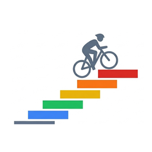

<p align="center">
  
</p>

<h1 align="center">Domestique</h1>

<p align="center"><b>An adaptive cycling training planner that closes the loop between what you planned and what you actually did.</b></p>

<p align="center">
  
  
  
  
  
  
</p>

Domestique builds you a periodised training plan, ships **3,054 structured ZWO workouts**, imports your post-ride FITs, and feeds *every* signal — TSS overshoot, polarisation breach, soreness, DFA α1, aerobic decoupling, training monotony, eFTP drift — back into the next day's plan. Most "smart" planners stop at the dashboard. Domestique mutates the prescription.

## Why this exists

Most training apps fall into one of two modes:

- **Display-only**: HRV widgets, Banister fitness curves, polarisation rings — beautiful charts, zero behavioural feedback.
- **Calendar-based**: a fixed 12-week plan that doesn't care what you actually did yesterday.

Domestique is neither. Every signal that touches the dashboard also has a code-path that mutates a future session. Examples:

- **Soreness ≥ 6/7** on the morning Hooper composite form → today's VO₂max session is forced to recovery, period (Hooper & Mackinnon 1995, Cheung et al. 2003 — peripheral fatigue is independent of central HRV).
- **Last week's actual TSS > 1.5 × planned** → next week's TSS budget auto-cuts 15% (Gabbett 2016, ACWR sweet spot 0.8–1.3).
- **Rolling 48 h Z5+ ≥ 25 min** (cycling included) → today is forced to Z2 even with positive TSB (Hulin et al. 2014).
- **Mid-cycle FTP recalibration** at the build1→build2 phase boundary auto-tests your FTP so the next 4 weeks of TSS targets aren't computed against a stale baseline (Allen & Coggan, *Training and Racing with a Power Meter* 3rd ed.).

Seven science-grounded guardrails (G1–G7), each citing a specific paper, plus a 1-week consolidation phase at the end of every non-event cycle so people don't ride straight from a peak into a fresh build with elevated fatigue (Mujika 2010).

## What's in the box

- **Adaptive training plan** — Base / Build1 / Build2 / Peak / Taper or Consolidation, sized from your CTL and target. Daily-adapt + reforecast + regenerate, all wired to live data.
- **3,054 ZWO workouts** — content-classified into 11 classes; a 24-week plan picks **150 distinct files** (every session is a different workout).
- **622 virtual routes** — Watopia, Yorkshire, Innsbruckring, Alpe d'Huez, Stelvio + 160 real-world courses; export as CRS or GPX.
- **FIT import + post-ride viewer** — power / HR / cadence curves, zone distribution, aerobic decoupling, DFA α1, polarisation classification (Treff et al. 2019).
- **Capability projection** for events — Allen-Coggan IF-by-duration + Pinot & Grappe 2011 RPP climb gate predict your finish, surface endurance / power / climb gaps in a 12-week build-up bar chart.
- **Finished-programme summary** — 12-metric recap (FTP / eFTP / VO₂max Δ, polarisation, monotony, mean-max power curve, Hooper trend, totals, decoupling) exportable as PNG (Pillow) or PDF (browser print).
- **Hardware-agnostic** — generate ZWO, ride in MyWhoosh / Tacx / Zwift / Hammerhead Karoo / outdoors, import the FIT back.
- **Single-user, localhost-only** — all data in `~/.domestique/profiles/<id>/`, [intervals.icu](https://intervals.icu) API key with `chmod 0600`, no telemetry, no cloud.

## Architecture

Pure Python, flat module layout — every `.py` at repo root is `import`ed
by another root module. PyInstaller bundles them as-is (no `domestique/`
package wrapper) so the spec, the DMG, and the EXE all stay simple.

```
domestique/
├── app.py                    — FastAPI app + ~70 endpoints (the "everything" entry)
├── launcher.py               — PyInstaller entry; opens pywebview window, boots uvicorn
├── training_planner.py       — Periodised plan generator + injury guardrails (G1–G7)
├── training.py               — Daily metrics, readiness, adapt-today-session
├── training_live.py          — Live ride session engine
├── ride_storage.py           — FIT archive + per-ride summarisation
├── fit_activity.py           — FIT parser wrapper (fitparse)
├── fitness_estimation.py     — eFTP drift, mean-max curve, capability projection
├── analytics.py              — NP / IF / TSS / decoupling / polarisation / DFA α1
├── readiness.py              — HRV / TSB / Hooper / sleep / RHR composite
├── profile_manager.py        — Multi-user profiles + ICU credentials
├── migrate_profiles.py       — One-shot profile migrations (called from app.py)
├── ride_report_png.py        — Pillow-rendered post-ride summary
├── programme_summary_png.py  — Pillow-rendered finished-programme recap
├── route_archetypes.py       — Procedural route shape primitives
├── geodesy.py                — GPX distance / elevation math
├── gpx_to_gc.py              — GPX → Golden Cheetah CRS converter
├── zones.py                  — Power / HR zone math
├── sleep.py, sleep_inhibit.py — Sleep parsing + macOS caffeinate hook
├── db.py, config.py, log_config.py — SQLite + config + logging plumbing
├── domestique.spec           — PyInstaller build spec
├── build_dmg.sh / build_win.bat — macOS DMG + Windows ZIP packagers
├── routes.json, profiles_indexed.json, surface_types.json,
│   route_profiles.json       — Heavy data shipped via PyInstaller `datas=`
├── tests/                    — pytest suite (~60 files; run `pytest -q`)
├── docs/                     — Architecture, science deep-dives, build guides
├── scripts/                  — One-off generators + scrapers (NOT imported by app.py)
├── workouts/                 — 3,054 ZWO interval workouts
├── courses/                  — Real-world climb library (CRS files, per-region subdirs)
├── static/, templates/       — FastAPI assets + Jinja2 templates
├── assets/                   — App icons (icon.icns / icon.ico / icon.png)
├── gpx_sources/              — Source GPX feeding `gpx_to_gc.py`
├── plans/, profiles/         — Per-user runtime state (gitignored after first use)
└── .github/workflows/        — `release.yml` builds + uploads DMG and EXE on tag
```

## Read more

- **[How the planner thinks (logic + science)](#how-the-planner-thinks-logic--science)** — every threshold cited, every formula explained.
- **[Auto-matching your rides to planned sessions](#auto-matching-your-rides-to-planned-sessions)** — how `done` / `ambiguous` / `no_match` are decided.
- **[CHANGELOG.md](CHANGELOG.md)** — the full pre-1.0 development log.
- **[Releases](https://github.com/platypus45/domestique/releases/latest)** — macOS DMG + Windows EXE attached to every release; both built and signed-style packaged in CI.

---

## Workflow

1. Domestique builds your weekly plan (Base / Build / Peak / Taper, adapted from your actual training load, readiness, and HRV).
2. Pick today's workout from the plan card → download the ZWO (or bulk-copy the library into Golden Cheetah's workout folder once).
3. Ride outside or indoors with any app/device of your choice.
4. Import the `.fit` back into Domestique → post-ride report, FTP-test detection, and (critically) **the next-day plan adapts automatically** based on what the ride showed.

---

## What Makes It Different

### Closed feedback loops (new in v4.1.0)
Most "smart" planners compute HRV, decoupling, monotony — then do nothing with them. Domestique actually uses them:

- **DFA α1 < 0.5 over last 3 rides** → tomorrow's threshold session auto-swaps to Z2, with a revert button
- **Aerobic decoupling > 5%** → next-day "Z2 recommended" advisory banner
- **Foster Monotony > 2.0 over 14 days** → next week's planned TSS auto-cut 15%
- **Intervals.icu eFTP drift > 3% for 7+ days** → FTP auto-updated with 48h revert toast
- **Local CTL fallback** — 42-day EWMA from your own ride TSS when ICU is unavailable (no more hardcoded 37.0)

### FTP test flow (works end-to-end)
Ride a Coggan 20-min test or Ramp test in Golden Cheetah / any app → import the FIT →
- App detects the test by power-profile shape (no manual marking needed)
- Computes suggested FTP: 0.95 × avg 20-min power (Coggan) or 0.75 × best 1-min (Ramp)
- Modal pops up: **Update / Keep / Custom**
- Ramp auto-halt detection (cadence < 50 + power < 85% target for 3s) — captures which step you gave up at
- Every FTP change logged in a `ftp_test_history` ledger with source provenance (`tested_coggan_20min` / `tested_ramp` / `eftp_auto` / `manual`) + sparkline chart in Settings

### DFA Alpha1 — from FIT, not live

DFA α1 is computed post-ride from beat-to-beat RR-intervals (HRV — heart-rate variability), not from average HR. It's fed into the planner as a fatigue signal that can downgrade tomorrow's intensity (Rogers et al. 2021 — α1 < 0.75 marks aerobic-threshold drift).

**Hardware requirement — explicit:** DFA α1 needs a heart-rate sensor that emits **RR-intervals** over ANT+ / Bluetooth. Your head unit then writes them to the FIT file as `HrvMessage` records.

| Sensor | Records RR-intervals? | DFA α1 supported |
|---|---|---|
| Garmin **HRM-Pro** / **HRM-Pro Plus** / **HRM-Dual** chest strap | ✅ yes | ✅ |
| **Polar H10** chest strap | ✅ yes | ✅ |
| **Wahoo TICKR X** chest strap | ✅ yes | ✅ |
| **Polar Verity Sense** (arm strap, HR mode only) | ✅ yes | ✅ |
| Optical wrist HR (any Garmin Forerunner / Edge optical / Apple Watch / Fitbit) | ❌ averaged HR only | ❌ |
| Coros / Suunto wrist optical | ❌ | ❌ |

If you ride with optical-only HR, Domestique still tracks NP / TSS / IF / TSB and the existing G1–G7 guardrails work. You just don't get the autonomic-fatigue layer; G9 (v1.1.0) won't fire for you.

**Acquisition path (post-v1.0.7):** the chest strap polls itself; the head unit (Garmin Edge / Forerunner / Wahoo / Karoo) records every RR-interval into the FIT file; Domestique pulls the raw FIT from ICU's `/api/v1/activity/{id}/fit-file` endpoint, parses the `HrvMessage` records with `fit_activity.parse_hrv_messages()`, runs sliding-window DFA α1, writes the result to the ride summary. **No live polling, no Garmin OAuth, no manual upload.** Just wear a chest strap.

**⚠ One-time Garmin device setting required.** Most Garmin head units ship with HRV recording **disabled** for activities — they use HRM-Pro's RR data for Body Battery / Stress / morning HRV (which is what populates `wellness.hrv` already), but they don't write per-beat RR-intervals to the FIT unless you explicitly enable it.

**Important: the HRM-Pro strap itself doesn't have an HRV toggle** — it always emits RR-intervals over ANT+ / BLE. The toggle that tells the head unit to RECORD what the strap is sending lives under the head unit's **Data Recording** menu, NOT under Sensors / HRM (which only configures pairing / battery / ANT ID).

| Device family | Exact path |
|---|---|
| **Edge 530 / 830 / 1030 / 1030 Plus / 1040** | Settings (gear icon) → Activity Profiles → [Bike] → Data Recording → **HRV** = On |
| **Edge Explore / Edge 130** | Firmware doesn't expose HRV recording; not supported |
| **Fēnix 8** | Hold watch face → Watch Settings → System → Advanced → **Data Recording → Log HRV** = On (verified against [Fēnix 8 owner's manual](https://www8.garmin.com/manuals/webhelp/GUID-EECCAC99-90D6-4AB1-9A3A-EC433D3365E2/EN-US/GUID-62E32BA1-D258-421A-A192-D7DB5453F7EB.html)) |
| **Fēnix 6 / 7 / Epix 2** | Settings → System → Data Recording → **Log HRV** = On |
| **Forerunner 255 / 265 / 745 / 945 / 955 / 965** | Settings → System → Data Recording → **Log HRV** = On (firmware-dependent — also try System → Advanced → Data Recording on newer firmwares) |
| **Some watches with newer firmware** | Settings → Physiological Metrics → Log HRV |
| **Garmin Connect Mobile** (universal fallback) | Devices tab → [your device] → Activity Profiles → Cycling → Data Recording → enable **HRV** or **Beat-to-Beat** |

**Common mistake**: looking for HRV under Sensors → HRM. That menu only configures the strap (pairing / battery / ANT ID). The recording toggle is under **System → Data Recording** (or **System → Advanced → Data Recording** on Fēnix 8). Bonus: while you're in that menu, switch from "Smart Recording" to **"Every Second"** for maximum data fidelity (slightly larger FIT files but more precise DFA α1 windows).

We verified this against a real ride: an HRM-Pro paired correctly to an Edge can still produce a FIT with **zero `HrvMessage` records** if the device-side recording flag is off. The FIT contains 4 000+ records of HR / power / cadence / GPS as expected, but the per-beat RR series isn't captured. After flipping the setting, future rides will include the data; pre-existing rides can't be backfilled.

**Domestique detects this and prompts you (v1.0.7).** When a synced ride has heart-rate data but no `HrvMessage` records, the app surfaces a one-time toast: *"Your last ride had HR but no beat-to-beat HRV — enable HRV recording on your Garmin to unlock DFA α1 fatigue tracking. [Show me how] [Dismiss] [Don't show again]."* `[Show me how]` opens a modal with the device-by-device table above. The toast is per-version (won't re-fire after dismissal until a new release).

**Resting HRV (separate signal):** Garmin's morning HRV (rMSSD overnight) lands in Domestique automatically via the ICU wellness sync — `wellness.hrv` is already populated for any rider whose Garmin Connect is linked to ICU. This is the input for v1.1.0's Bayesian readiness composite. Different from in-ride DFA α1; both come for free with the same hardware.

### Score rubric (structure-aware, not just TSS)
Each workout gets a 1-10 score combining TSS (60%), protocol variety (distinct power targets above Z2), and VO2 bonus (presence of >105% FTP intervals). Fills the library's "Min Score" filter with something meaningful.

### Adaptive re-draw
`/api/plan/re-draw` re-rolls a day's workout when you want a swap — excludes what you did earlier in the week, keeps variety. Drag-drop moves persist through ISO-week boundaries (bug introduced by Sat-Fri vs Mon-Sun merge is fixed).

### 622 virtual routes
Watopia, Yorkshire, Innsbruckring, Alpe d'Huez, Mont Ventoux, Stelvio + 160 real-world courses. Export as CRS (RGT format) or GPX for route-based riding in Golden Cheetah / Wahoo / Garmin.

---

## Core Features

### Plan
- **Training plan generator** — periodized Base / Build / Peak / Taper phases, phase-deterministic HIT type rotation, used-names dedupe across weeks
- **Weekly plan** — drag-drop reschedule, daily adaptation from ICU + local signals
- **FTP test protocols** — Allen-Coggan 20-min + Ramp (shipped in library); detection on FIT import works; ramp halt auto-detected post-hoc
- **reforecast** — negative TSB downshifts future hard sessions automatically
- **Cross-sport load** — running / lifting / other ICU-synced sports influence cycling plan

### Workout library
- **3,054 structured workouts** — endurance, sweet spot, threshold, VO2max, sprint, over-under, pyramid, FTP tests
- **ZWO `<tags>` indexed** — filter library by `?tags=ftp_test`, new "FTP Tests" category tab in dashboard with yellow-border cards
- **Click-to-download** ZWO from library → load into Golden Cheetah / MyWhoosh / Tacx / Zwift
- **622 virtual routes** — 3 worlds, 41 famous climbs, 160+ real-world courses (CRS + GPX export)

### Post-ride analysis
- **Import FIT** — drag-drop .fit upload, parsed and archived under `~/.domestique/rides/`
- **Ride detail report** — power/HR/cadence/speed curves, zone distribution, decoupling scatter, NP/TSS/IF
- **DFA α1** from RR-intervals if present
- **Aerobic quality panel** — Pw:Hr decoupling + Efficiency Factor + DFA α1
- **FTP-test detection** — sets `is_ftp_test`, `ftp_test_type`, `ftp_test_suggestion`, `ftp_test_halted` on import
- **FIT → Intervals.icu one-way upload** — ride lands in ICU automatically after import

### Track
- **Intervals.icu sync** — CTL/ATL/TSB fitness chart, activity history, HRV trends, FIT upload
- **Local CTL fallback** — 42-day EWMA from your FIT library when ICU is offline
- **Multi-user profiles** — each rider with their own FTP (with provenance), zones, plan, history
- **FTP history ledger** — every change captured with source + date; sparkline chart in Settings
- **Manual FTP edit confirm dialog** — no accidental overwrites of tested values
- **Dashboard** — fitness chart, weekly overview, workout library browser, route browser, settings

---

## Recommended external apps

Domestique plans + analyzes — you ride in a separate app. See [docs/cycling_apps.md](docs/cycling_apps.md) for the full table; the free-forever picks with ZWO/FIT import + Tacx Neo 2T support:

| App | Free? | ZWO import | Notes |
|---|---|---|---|
| **Golden Cheetah** | ✅ open-source | ✅ ZWO/ERG/MRC | Best match for a planner+library+viewer app like this one; drive the trainer via ANT+ FE-C; drop Domestique's library into GC's workout folder once, all 3054 files appear in Train view |
| **MyWhoosh** | ✅ fully free | ✅ via web builder | Scenery + Zwift-style ride experience; full ERG on Neo 2T |
| Tacx Training | ✅ free with Tacx HW | ❌ ZWO, only GPX | Native Tacx integration but no ZWO import |

### No laptop? Drive your smart trainer from a head unit / watch with the FIT export

Both download formats — **ZWO** and **FIT** — drive a smart trainer in ERG, just through different middlemen:

- **ZWO** → load into a virtual-trainer app on a laptop / phone (MyWhoosh / Tacx / Zwift / Golden Cheetah) → the app pairs to your trainer over ANT+ FE-C or Bluetooth FTMS and steers power.
- **FIT** → push to a **Garmin Edge**, **Hammerhead Karoo**, **Wahoo ELEMNT**, or compatible Garmin watch (Forerunner / Fenix / Edge series with the Workouts feature) → the head unit pairs to your trainer over ANT+ FE-C or Bluetooth FTMS and steers power directly. **No laptop, no virtual world, no subscription.** Just the head unit → trainer.

To use the FIT path: click "Download FIT" in any session card, drop the file into Garmin Connect / Hammerhead Dashboard / Wahoo ELEMNT Companion under the "Workouts" section, then sync to the device. Start the workout on the head unit and pair your trainer when prompted — the device drives the resistance per the structured intervals (ERG mode) and shows you the targets in real time.

This is the cleanest setup for outdoor + indoor athletes who already own a head unit and a smart trainer and don't want a screen-with-Watopia-on-it style experience.

---

## Quick Start

### Download

Prebuilt binaries are published on the [Releases page](https://github.com/platypus45/domestique/releases/latest):

| Platform | File | How |
|---|---|---|
| **macOS** (Apple Silicon + Intel) | `Domestique.dmg` | Open the DMG, drag the app icon onto the Applications alias |
| **Windows 10/11** | `Domestique-Windows.zip` | Unzip, run `Domestique.exe` (Windows Defender may prompt) |

Binaries are built automatically by [GitHub Actions](.github/workflows/release.yml) on every tagged release.

### Installing the unsigned DMG (macOS)

Releases are currently **not** codesigned or notarized — the project has no Apple Developer ID. Gatekeeper will show "Domestique is damaged and can't be opened" on first launch. To bypass:

1. Open the DMG → drag `Domestique.app` onto the `Applications` icon.
2. **Right-click** (or Control-click) `Domestique.app` → **Open**.
3. In the dialog, click **Open** again. macOS remembers the choice after the first launch.

If the app still refuses to open, run once from Terminal:
`xattr -dr com.apple.quarantine /Applications/Domestique.app`.

### Installing on Windows (SmartScreen)

The Windows EXE is also unsigned. On first run, SmartScreen shows a blue "Windows protected your PC" dialog. Click **More info → Run anyway**.

### First-run secrets

On first launch the setup wizard writes Intervals.icu credentials to a per-profile env file at `~/.domestique/profiles/<id>/.env` (mode 0600). There is no repo-root `.env`.

### From source
```bash
git clone https://github.com/platypus45/domestique.git
cd domestique
pip install -r requirements.txt
python launcher.py
```

### Build your own
```bash
# macOS
./build_dmg.sh        # writes ~/Desktop/Domestique.dmg with drag-to-install layout

# Windows
build_win.bat         # writes dist\Domestique\Domestique.exe
```

### Intervals.icu (optional but recommended)
Connect in Settings > Intervals.icu with your Athlete ID and API key from [intervals.icu/settings](https://intervals.icu/settings). Without ICU, Domestique falls back to local CTL computation from your imported FITs.

---

## Updating Domestique

Drag the new DMG onto your Applications folder. **Your rides, training plan, FTP history, wellness logs, ICU credentials, and athlete profile all survive the install** — they live in `~/.domestique/` outside the app bundle and are never touched.

On first launch after an upgrade you'll see a one-off confirmation toast naming the version transition and the data preserved.

See [docs/upgrading.md](docs/upgrading.md) for the full per-data-type preservation table and rollback steps.

---

## How the planner thinks (logic + science)

Every threshold below is in the code with an inline citation. This section explains *why* each value, not just *that* it exists.

### 0. The training-load model — TSS / IF / NP / CTL / ATL / TSB

Domestique uses the canonical Coggan / Allen / Banister fitness-fatigue framework end-to-end. Every number on the dashboard rolls up from these primitives.

#### Per-ride scalars (computed on FIT import OR pulled from intervals.icu)

| metric | formula | what it captures | code |
|---|---|---|---|
| **NP** (Normalised Power) | 1. 30-second rolling average of the raw power trace<br>2. Raise each rolled value to the 4th power<br>3. Average those<br>4. Take the 4th root | "Equivalent steady-state power that would have produced the same physiological cost." The 30-s window approximates physiological response lag; the 4th power penalises spikes more than steady riding. | `analytics.py compute_normalised_power()` |
| **IF** (Intensity Factor) | `NP / FTP` | Unitless. IF=1.0 = sustained at threshold. IF=0.7 = tempo. IF=1.1 = hard interval. | inline |
| **TSS** (Training Stress Score) | `(duration_seconds × NP × IF) / (FTP × 3600) × 100` | Calibrated so 1 h at exactly FTP = 100 TSS. Quadratic in IF, linear in duration. | inline |
| **kJ work** | `avg_power_W × duration_s / 1000` | Total mechanical work. Used for nutrition planning (carb/hour target). | `ride_storage._summarise_ride()` |

**Honest about NP's recipe.** The 30-s window and the 4th-power exponent were chosen by Coggan empirically because the resulting numbers tracked rider-perceived effort. Neither falls out of any physiological first-principles model. They've been operationalised in commercial software for ~20 years; they have not been validated against any direct physiological criterion (lactate, VO₂, RPE-correlation aside). v1.0.6 adds a **Belastingscore (Strain Score, Kontro 2026)** as a complementary lens computed from per-second strain attribution rather than a rolling average — see [§0e](#0e-belastingscore--3d-impulse-response-model-v106).

#### Multi-day fitness/fatigue (Banister 1975 impulse-response, Coggan/Allen refinement)

| metric | formula | what it captures |
|---|---|---|
| **CTL** ("Fitness") | exponentially-weighted moving average of daily TSS with τ=42 days. `fitness_t = fitness_{t−1} + (TSS_t − fitness_{t−1}) / τ`. | A long-window memory of how much load you've been absorbing. Builds slowly, fades slowly. |
| **ATL** ("Fatigue") | same EWMA with τ=7 days. | Short-window memory of recent stress. |
| **TSB** ("Form") | `CTL − ATL`. | Positive = freshening up; deeply negative = overreached; near zero = "in the work." |

**Honest about τ=42/7.** These time constants are conventional, not validated per-athlete. They trace back to early-1990s Banister fits on athletes who weren't even cyclists; published τ₁ values across literature span ~21 to >60 days for fitness, and ~5 to ~20 days for fatigue (see Table 2 of [Kontro et al. 2026](https://journals.plos.org/plosone/article?id=10.1371/journal.pone.0341721)). Domestique ships with the conventional 42/7 because that's what every commercial platform also ships, but a future version will fit τ per-athlete from a ≥6-month log.

#### What τ (tau) actually means and why it matters

τ is the **time constant** of an exponentially-weighted moving average. The differential equation is:

```
dy/dt = (input − y) / τ
```

In plain English: each day, the metric (`y`) moves toward today's input (`TSS`) by a fraction `1/τ` of the gap between them. The discrete daily form Domestique uses is the standard PMC update:

```
y_today = y_yesterday + (TSS_today − y_yesterday) / τ
```

**What different τ values mean physically:**

| time elapsed | how much of a step-change the metric has absorbed |
|---|---|
| 1 × τ days | ~63 % (= 1 − 1/e) |
| 2 × τ days | ~86 % |
| 3 × τ days | ~95 % |
| 5 × τ days | ~99 % |

So with **τ = 42 days for CTL**: a single 200-TSS workout raises CTL by `200 / 42 ≈ 4.8` points the next day, and the contribution decays to half its remaining effect every ~29 days (the half-life is `τ × ln(2) ≈ 0.69 × τ`). After ~6 weeks, the workout's contribution is mostly absorbed into the equilibrium.

With **τ = 7 days for ATL**: the same workout raises ATL by `200 / 7 ≈ 28.6` points, and decays to half-effect in ~5 days. ATL "forgets" much faster than CTL.

**Why the gap between τ values creates "Form" (TSB):**
- Today's hard ride spikes BOTH curves up.
- Over the next week, ATL falls fast (small τ); CTL barely budges.
- TSB = CTL − ATL therefore RISES through the recovery week — you "freshen up."
- Stop training entirely, and ATL → 0 in ~3 weeks while CTL → 0 takes ~5 months. That's the structural reason classic taper plans are short (let ATL drop) and classic detraining curves are long (CTL is sticky).

**Why τ choice is consequential:**
- Pick τ_CTL too small (say 21 days) and CTL becomes too reactive — you'll over-react to a single hard week.
- Pick τ_CTL too large (say 70 days) and CTL becomes too sluggish — you'll under-react to a real fitness gain or loss.
- Per-athlete variation is real: a young rider rebounding from a single hard week behaves like τ ≈ 25 days; a masters rider needs τ ≈ 55 days for the same recovery shape ([Hellard et al. 2017](https://pubmed.ncbi.nlm.nih.gov/29059038/)).
- Commercial platforms ship τ = 42/7 as a one-size-fits-all default; a more rigorous build would fit τ per-athlete from at least 6 months of TSS + race-performance pairs. v1.0.7 roadmap.

**Why v1.0.6 has THREE pairs of τ values** (CP / W' / Pmax): the [Kontro paper](https://journals.plos.org/plosone/article?id=10.1371/journal.pone.0341721) argues each energy system has its own time scale — the PCr (Pmax) system recovers in seconds-to-days while the aerobic (CP) system takes months. Forcing all three into one τ pair (the Banister 1975 single-curve model) loses that physiology. So v1.0.6's 3D model has τ_CP = 52/10, τ_W' = 5/5, τ_Pmax = 10/4 — the same EWMA math, three times in parallel.

#### Where each metric comes from

- **ICU-synced rider**: `training.get_today_metrics()` pulls CTL/ATL/TSB from intervals.icu's wellness API.
- **ICU-unreachable**: `ride_storage.compute_local_ctl()` rebuilds CTL from your local FIT archive (42-day EWMA over `summary.tss`). Same algorithm, different source.
- **Per-ride zone-time, polarisation, decoupling**: `analytics.py compute_polarization_block()` and the FIT zone-counting in `ride_storage._summarise_ride()`.

#### TSB-driven daily caps

- **TSB < −10**: dashboard shows "Recover" badge.
- **TSB < −25**: `reforecast()` drops the next hard session one tier (`vo2max → threshold → tempo`).
- **TSB < −30**: deeply overreached. `daily_adapt_plan()` rescales remaining-week TSS to 0.6× as a forced de-load. Coggan/Allen overload threshold.

---

### 0a. Honest limitations of the TSS-based stack

The peer-reviewed evidence supporting TSS as a *quantifier of training that was done* is reasonable. The evidence supporting it as a *predictor of training that will work* is correlational, mixed, and rarely tested out-of-sample. Domestique acknowledges this directly:

| Study | n | finding |
|---|---|---|
| [Sanders et al. 2017](https://pubmed.ncbi.nlm.nih.gov/28095100/) | road cyclists, season-long | TSS correlated **r ≈ 0.75–0.79** with sub-maximal lactate-threshold power changes |
| [Wallace et al. 2014](https://pubmed.ncbi.nlm.nih.gov/24766776/) | runners | TSS vs. 1500 m time **r ≈ 0.70**, slightly better than TRIMP (r ≈ 0.65) and session-RPE (r ≈ 0.60) |
| [Vermeire et al. 2021](https://pubmed.ncbi.nlm.nih.gov/34107251/) | 11 recreational cyclists, 12 weeks | **inconsistent** associations between TSS, multiple TRIMP variants, and 3 km TT performance. Different training types produce different adaptations despite identical TSS — "the relationship to performance will always be distorted." |

**Where TSS works:** as a workout descriptor for steady-state efforts; as a cumulative dose tracker when training is homogeneous; as a rough heuristic for taper/race timing.

**Where TSS breaks:** when training is intensity-heterogeneous (interval-heavy ≠ endurance-heavy at same TSS); when efforts are above FTP and duration matters (the minute-2 vs minute-19 problem); when one event-specific energy system dominates; when workouts are highly intermittent (the NP recipe was designed for steady road riding, not 30/30 intervals).

**How Domestique mitigates** without replacing TSS as the primary load currency: the seven injury-prevention guardrails (G1–G7) layered on top of TSS-driven planning capture several of the failure modes Vermeire flags — see [§0b](#0b-literature-wired-into-the-planner) below.

---

### 0b. Literature wired into the planner

| Critique area / failure mode | Mitigation in Domestique | Source |
|---|---|---|
| Heterogeneous intensity (interval ≠ endurance at same TSS) | **G3 polarization-breach guardrail** + Treff polarization index classification | [Treff et al. 2019 (PMC)](https://pmc.ncbi.nlm.nih.gov/articles/PMC6582670/), [Stöggl & Sperlich 2014](https://pubmed.ncbi.nlm.nih.gov/25309613/) |
| Above-FTP minute-2-vs-minute-19 (Kontro's headline) | **Live W'-balance during ride** (Skiba 2015 differential) at `training_live.py:500-545` | [Skiba 2012 (PMID 22382171)](https://pubmed.ncbi.nlm.nih.gov/22382171/) |
| Acute:chronic load mismatch | **G4 ACWR** (7-day load > 1.5 × 28-day → trim next week 15 %) | [Gabbett 2016 (BJSM)](https://bjsm.bmj.com/content/50/5/273) |
| Yesterday-was-hard / RPE 3-day drop | **G1 monotony** + **G7 RPE drop** | [Foster 1998 (PMID 9694422)](https://pubmed.ncbi.nlm.nih.gov/9694422/) |
| Z5+ accumulation ceiling | **G2 48 h Z5+ ≤ 25 min** | [Hulin et al. 2014 (BJSM)](https://bjsm.bmj.com/content/48/8/708) |
| Subjective fatigue TSS misses | **G5/G6 Hooper composite** + peripheral fatigue cap | [Hooper & Mackinnon 1995](https://pubmed.ncbi.nlm.nih.gov/8531627/), [Cheung et al. 2003](https://pubmed.ncbi.nlm.nih.gov/12831711/) |
| 80/20 polarisation target | **POL 80/0/20** distribution baked into `WORKOUT_MIX_PREFERENCE` | [Stöggl & Sperlich 2014](https://pubmed.ncbi.nlm.nih.gov/25309613/) |
| Autonomic fatigue TSS can't see | **DFA α1 from RR-intervals** → next-day intensity decision | [Rogers et al. 2021](https://pubmed.ncbi.nlm.nih.gov/34547011/) |
| Climb-specific record power profile | **Pinot & Grappe 2011 RPP gate** for capability projection | [Pinot & Grappe 2011](https://pubmed.ncbi.nlm.nih.gov/22090214/) |
| CP-from-FTP approximation | `int(ftp × 1.03)` (was naive `CP = FTP`) | [McGrath et al. 2021](https://pubmed.ncbi.nlm.nih.gov/33999907/) |
| FTP detection from real rides | Auto-eFTP from FIT archive + ICU eFTP cross-check | inline `fitness_estimation.py:220-263` |
| W' / Pmax energy-system decomposition (v1.0.6) | **Belastingscore quartet** (Aerobe / Glycolytisch / PCr) — secondary lens to TSS | [Kontro et al. 2026 (PLOS ONE)](https://journals.plos.org/plosone/article?id=10.1371/journal.pone.0341721) |

These guardrails layered on top of TSS-driven planning are what makes Domestique more than a TSS-EWMA dashboard. They directly address several of the failure modes Vermeire 2021 flags, while keeping TSS as the central currency the rider sees.

---

### 0c. Norwegian Method support — what's in, what's missing

The Norwegian Method (Marius Bakken / Ingebrigtsen / Bjørgen) explicitly **rejects TSS** as the primary intensity controller and substitutes blood lactate. Domestique covers parts of it but not the lactate-pacing core.

**Explicit non-goal:** Domestique does **not** capture or prescribe blood lactate during training. Finger-prick / earlobe-prick blood sampling adds friction we don't want — riders shouldn't have to draw blood mid-ride to use the planner. So we don't ship lactate input fields, lactate-prescribed sessions, or MLSS test protocols. Instead, we approximate the same physiology using signals already captured non-invasively from the FIT file (HR + RR-intervals → DFA α1 + autonomic load) and from the power trace (Skiba W'-balance + post-ride decoupling).

| Norwegian Method element | What it controls intensity by | Domestique substitute |
|---|---|---|
| Lactate-controlled threshold work | Blood lactate 2-4 mmol/L during the session | **Power-based threshold class** (95-105 % FTP) + **HR ceiling** at ~88 % HR_max → flags G6 if exceeded for >15 min in a sub-threshold session. |
| Double-threshold sessions (AM + PM) | Two sub-LT2 sessions same day | Partially — threshold-class workouts exist; v1.1.0 adds explicit AM/PM scheduling **without lactate gating**. |
| HR as primary intensity proxy when lactate isn't available | HR ceiling that approximates LT2 | HR ingested from FIT; v1.1.0 wires HR-ceiling into session prescription (e.g. "stay below 88 % HR_max for the steady block"). |
| MLSS testing protocol | Distinct test from FTP, requires blood draws | **Out of scope.** FTP + Coggan-20 + Ramp tests only. |
| Conservative volume ramp (no big TSS spikes) | Total volume in hours | ✅ Tracked + Gabbett ACWR (G4) caps weekly TSS jumps. |
| Avoidance of the moderate/threshold "trap" (Seiler-style) | Sessions explicitly avoid Z3 (76-90 % FTP) | ✅ Stöggl/Sperlich 80/0/20 + G3 enforce this. |
| Daily readiness signal (Bakken: lactate response to a fixed warmup) | Resting lactate or sub-LT1 sample-power | **DFA α1 from RR-intervals** — same physiological substrate (autonomic / parasympathetic withdrawal proxy). [Rogers et al. 2021](https://pubmed.ncbi.nlm.nih.gov/34547011/) shows DFA α1 tracks the LT1 boundary non-invasively from beat-to-beat HR variability. |
| In-session "back off" signal | Lactate climbing above 4 mmol/L | **W'-balance** from Skiba 2015 differential — depleting W' captures the same "above-threshold for too long" dynamic that drives lactate accumulation. Live during ride. |
| Workout-was-too-hard detection | Post-session lactate elevation | **Aerobic decoupling** post-ride from FIT (HR drift vs. power drift) + DFA α1 nadir during the session. |

**The honest framing**: Domestique gives you a Norwegian-Method-shaped polarization plan (80/0/20, Z3 avoidance, conservative ramp) and approximates the daily-readiness piece via DFA α1 (autonomic) and W'-balance (mechanical) — both come for free from the FIT file with the right sensors. We don't replicate the lactate-prescribed precision of the Norwegian elites, but we capture the *intent* (sub-LT2 controlled work + autonomic-fatigue-aware day-to-day adjustment) without asking the rider to bleed.

**v1.1.0 design sketch (no lactate input):**
- **HR-ceiling-prescribed sessions**: a new session attribute `hr_ceiling_pct` derived from HR_max. Threshold-class sessions get prescribed as "≤ 88 % HR_max for the steady block" alongside the existing power target. Watch deviates → flagged in post-ride QA.
- **Double-threshold scheduling**: explicit AM + PM same-day pattern in the planner for build/peak weeks, both sessions sub-threshold by design (e.g. 3×10 min @ 88-92 % FTP + 4×8 min @ 88-90 % FTP) — power-prescribed only.
- **DFA α1 as the daily readiness gate**: when DFA α1 was depressed yesterday (< 0.75 sustained), today's HIT slot drops one tier — same logic as the existing TSB-based G7 cap, just keyed off autonomic data.
- **W'-balance live readout**: already implemented at `training_live.py:500-545`; v1.1.0 adds a "back off" toast when W'-balance drops below 50 % during a sub-threshold block (signals the rider is fatiguing faster than the prescribed power suggests).

---

### 0d. How a ride is indexed end-to-end

```
You finish a ride
  │
  ▼
Garmin / Wahoo / Karoo / virtual trainer uploads to Strava / intervals.icu
  │
  ▼
intervals.icu computes (server-side):
  ├─ NP, IF, TSS, kJ
  ├─ time-in-zone (Z1-Z7 + SS)
  ├─ aerobic decoupling
  ├─ polarization-index + classification (Polarized / Pyramidal / Threshold / HIIT / Base / Unique)
  └─ on-profile: wPrime, pMax (v1.0.6+), eFTP, CP
  │
  ▼
Domestique's _sync_icu_activities() (app.py:9141)
  │ pulls activities list
  │ fetches detail + samples per ride
  ▼
Cached as ~/.domestique/rides/icu/i<external_id>.json (24-field envelope)
  │
  ▼
SQLite athlete_metrics table ← daily CTL/ATL/TSB + (v1.0.6) per-component fitness/fatigue
  │
  ▼
Library matching ← Domestique's 16-class taxonomy (sweet_spot / threshold / vo2max / vo2_short / …)
  │ matches the picked workout's structure
  │ surfaces display_name as the modal title
  │
  ▼
Planner reads back on every reforecast / regenerate
  │ G1-G7 guardrails check what was actually done
  │ Treff PI feeds G3 polarization breach
  │ Auto-fire reforecast (v1.0.3) if added > 0
  │ Glycolytic-stacking soft penalty (v1.0.6 advisory)
  │
  ▼
Tomorrow's session adapts to today's ride
```

**What ICU computes vs. what Domestique computes:**
- **From ICU** (cached as-is): NP, IF, TSS, time-in-zone, aerobic decoupling, kJ above FTP, wPrime, pMax, eFTP, CTL/ATL/TSB defaults.
- **Locally computed by Domestique**: Treff polarization index + classification (so the result is identical even when ICU is offline), the 16-class library taxonomy match, the seven G1–G7 guardrails, eFTP cross-check from local FIT archive, capability projection (Pinot & Grappe RPP), DFA α1 (when RR-intervals are present in the FIT), Belastingscore (v1.0.6) for energy-system decomposition.

---

### 0e. Belastingscore / 3D impulse-response model (v1.0.6)

The 3-dimensional impulse-response model from [Kontro/Mastracci/Cheung/MacInnis 2026 (PLOS ONE)](https://journals.plos.org/plosone/article?id=10.1371/journal.pone.0341721) ships in v1.0.6 as an **additive lens** alongside TSS — not a replacement. It splits training stress into three energy systems with their own time constants:

| component | power-curve param | what it tracks | Banister τ₁ / τ₂ (paper defaults, profile-overridable) |
|---|---|---|---|
| **CP** (aerobic) | Critical Power | mitochondrial / oxidative capacity | 52 d / 10 d |
| **W′** (glycolytic) | W-prime, anaerobic work capacity | lactate-tolerance / above-CP work | 5 d / 5 d |
| **Pmax** (alactic) | Peak Power | PCr / sprint capacity | 10 d / 4 d |

**Per-ride breakdown (Kontro Eq. 8–10):** for each second of the ride, power is attributed to the three systems based on proximity to MPA (Maximum Power Available, Eq. 4). The result is **Belastingscore = SS_CP + SS_W′ + SS_Pmax**, calibrated so 1 h at CP ≈ 100 SS (matches the Coggan TSS convention).

**Where v1.0.6 surfaces it:**
- **Ride detail panel**: a secondary "Belastingscore — energy-system breakdown" card under the existing TSS hero grid (Total / Aerobe / Glycolytisch / PCr).
- **Athlete-Metrics chart**: a collapsed `<details>` panel below the existing CTL/ATL/TSB chart with three normalised fitness curves (CP / W′ / Pmax), τ defaults from the paper.
- **Plan tab phase rows**: a small subordinate stacked bar showing CP / W′ / Pmax distribution under the primary `weekly_tss` headline.

**Honest caveat the paper itself states**: "no published data exist to support the energy-system specific model parameters." The τ defaults (52/10, 5/5, 10/4) are a single-athlete illustrative example from the paper's supplementary, not population-validated. Domestique exposes them as profile-level overrides and documents the caveat in the dashboard tooltip copy.

**Why TSS stays primary:** the Kontro paper is intentionally additive — its authors keep the conventional Banister/CTL framework alongside the 3D decomposition. Domestique mirrors that. The 3D model adds resolution for athletes who want to see which energy system was stressed, but the planner still picks workouts based on the existing TSS-driven taxonomy the rider is already used to.

### 1. Periodisation engine

**Phases.** Standard Base → Build1 → Build2 → Peak → Taper for event-prep goals, or Base → Build1 → Build2 → Peak → **Consolidation** for non-event goals (FTP / VO2max / hybrid / general / endurance). Sized from `target_ctl` and `target_date` (Coggan & Allen, *Training and Racing with a Power Meter* 3rd ed.).

**Why consolidation, not taper, for FTP/VO2max cycles.** A taper is event-specific — you peak fresh on race day. If you don't have a race, you don't taper into a hole; you do a 1-week reduced-load Z2-only block to let fatigue dissipate and supercompensation peak (**Mujika 2010** *Sports Med* review: 7–14 day reduced-load period after a build block). Consolidation is `~50% of peak TSS` and ships an explicit prompt at end-of-week to FTP-test before generating the next cycle — this is the moment to cleanly capture your new fitness ceiling without residual fatigue depressing the result.

**Mid-cycle FTP recalibration (proactive overload prevention).** At the build1→build2 phase boundary the planner replaces one HIT slot with a Coggan-20 or Ramp `ftp_test` session. For cycles ≥ 16 weeks, a second test is also placed at the build2→peak boundary. This is a direct overload prevention: if your FTP rose 8% during build1 but the planner is still using the old value, all subsequent TSS targets and zone boundaries are computed against a baseline that's 8% too low — you train *systematically* harder than the model thinks. **Allen & Coggan TR&P 3rd ed.** recommends 4–6 week re-test cadence during build phases. The v4.1.0 eFTP-drift auto-apply path is *reactive* (waits for ICU to detect 7+ days of drift); the scheduled mid-cycle test is *proactive*.

**Weekly TSS budget** per phase (`training_planner.py PHASE_TARGETS`):

| Phase | Z1+Z2 hours | Z3+Z4 min | Z5+ min | Weekly TSS | Goal types |
|---|---|---|---|---|---|
| Base | 9.5 | 45 | 5 | 425 | all |
| Build1 / Build2 | 7.5 | 120 | 45 | 600 | all |
| Peak | 6.0 | 90 | 80 | 650 | all |
| Taper | 4.0 | 30 | 22 | 275 | event / ctl |
| **Consolidation** | 5.5 | 20 | 0 | 240 | FTP / VO2max / hybrid / general |

Synthesised from Seiler 2010, Mujika 2010, Rønnestad 2014, and Coggan/Allen for a trained age-grouper at ~10h/week. The intensity-distribution targets (`PHASE_POLARIZED_TARGETS`) come from the Seiler 2006 / Stöggl 2014 polarised model.

**CTL ramp safety**. The planner refuses to ramp CTL faster than `ramp_rate(current_ctl)` (steeper at low CTL, plateaus at high CTL). Override gate: TSB < −30 deep into a build phase pulls back the next week's `tss_target × 0.85` (Coggan/Allen overload threshold).

### 2. The seven injury-prevention guardrails (G1–G7)

Pre-v4.6.6 the planner detected fatigue / overload / soreness signals but never mutated the persisted plan. v4.6.6 wired the missing causation:

| # | Gate | Trigger condition | Action | Citation |
|---|------|---------|--------|----------|
| **G1** | Yesterday-was-hard floor | `yesterday_actual_tss / max(yesterday_planned, phase_daily_avg) > 1.5` | force today → Z2 | **Foster 1998** *Med Sci Sports Exerc* 30:1164 — session-load spike |
| **G2** | 48h Z5+ ceiling | rolling 48h `Σ z5–z7 ≥ 25 min` (cycling included) | force today → Z2 | **Hulin 2014** *Br J Sports Med* 48:708 — cumulative HI exposure |
| **G3** | Polarisation breach | current week `actual.z4plus_pct > target+8` OR `actual.z1z2_pct < target−10` | drop next 1–2 hard sessions one tier (vo2max → threshold → tempo) | **Seiler 2010 / Stöggl 2014 / Treff 2019** |
| **G4** | ACWR weekly scaling | last completed week `actual_tss / planned_tss > 1.5` | `next_week.tss_target ×= 0.85`, `hit_per_week −= 1` | **Gabbett 2016** *Br J Sports Med* 50:273 — sweet spot 0.8–1.3, >1.5 doubles injury risk |
| **G5** | Soreness peripheral cap | `daily_log.soreness ≥ 6` (1–7 scale) | force today → recovery, *regardless of HRV/TSB composite* | **Hooper & Mackinnon 1995** + **Cheung et al. 2003** — peripheral fatigue is independent of central HRV |
| **G6** | Hooper composite gate | `sleep + fatigue + stress + soreness ≥ 18` | force today → Z2 cap | **Hooper & Mackinnon 1995** — composite ≥18 = significant accumulated fatigue |
| **G7** | 3-day mean RPE drops HIT | `mean(ride.feel ∪ ride.perceived_exertion, last 3d) ≥ 7` AND today is HIT | drop today one tier | **Foster 1998** session-RPE |

**Priority chain** inside `adjust_today_session()`: `G5 > G6 > G2 > readiness composite > G1 > G7`. Earlier-firing gates short-circuit later ones. Each fired gate sets `s.adapted = True` and writes the citation into `s.description`.

### 3. The morning leg-check (Hooper composite)

The "Morning leg-check" prompt on the home page asks four 5-button questions:

1. **Sleep quality** — 😀 Great → 😫 Terrible
2. **Energy / fatigue** — 😀 Energised → 😫 Drained
3. **Stress** — 😀 Calm → 😫 Maxed
4. **Soreness** — 😀 Fresh → 😫 Very sore

**Why all four?** Hooper & Mackinnon 1995 (*J Sci Med Sport*) showed the *composite* predicts overtraining better than any single component. A rider can have crushed legs but score "fine" on subjective fatigue; a sleep-deprived rider can have fresh legs. The 4-field sum (range 4–28; threshold ≥18) catches what no single axis sees. **Saw et al. 2016** (*Br J Sports Med*) is the modern reinforcement: subjective wellness questionnaires correlate **better** with training response than any wearable HRV / RHR / sleep-score metric — self-report is the gold standard, not the fallback.

**How it wires back:**
- **20% weight** in `readiness_score` (combined with HRV 40%, TSB 20%, sleep 10%, RHR 10%).
- **G5 hard gate** — `soreness ≥ 6` forces recovery, bypassing the composite. Peripheral fatigue is real even when central HRV looks fine.
- **G6 hard gate** — `sleep + fatigue + stress + soreness ≥ 18` (Hooper threshold) forces Z2.

**Friction:** the form pre-defaults each field to "3 — Normal" so a user who only taps soreness still posts a sane composite. ~6 seconds of total tap time per morning. The 4 fields aren't optional — they're the science.

### 4. Closed feedback loops (the v4.1.0 originals)

Most "smart" planners compute these signals and then do nothing with them. Domestique actually mutates the next-day plan:

| Signal | Threshold | Action | Citation |
|---|---|---|---|
| **DFA α1** (autonomic balance) | mean over last 3 rides < 0.5 | tomorrow's threshold → Z2 (revert button) | Rogers et al. 2021 (PMID 33519504); Peng 1995 (DFA algorithm) |
| **Aerobic decoupling** (HR drift vs power) | > 5% over the last ride | next-day "Z2 recommended" advisory banner | Coyle & Gonzalez-Alonso 2001 (cardiac drift mechanism); TrainingPeaks canonical EF formula |
| **Foster monotony** (weekly load SD-vs-mean) | > 2.0 over 14 days | next week `tss_target × 0.85` and `hit_per_week − 1` | Foster 1998 *Med Sci Sports Exerc* (PMID 9662690) |
| **eFTP drift** (Intervals.icu) | > 3% above set FTP for 7+ consecutive days | FTP auto-applied with 48h revert toast | Allen & Coggan eFTP definition |
| **Local CTL fallback** | ICU unreachable | 42-day EWMA over your own imported FIT rides (no hardcoded baseline) | Coggan/Allen τ=42 |

### 5. FTP detection from a regular FIT

Ride a Coggan 20-min test or a Ramp test in any app, import the FIT:
- Detection by power-profile shape (no manual marking).
- Suggested FTP: `0.95 × avg 20-min power` (Coggan, Allen & Coggan 2019) or `0.75 × best 1-min` (Ramp, Ric Stern / British Cycling).
- Modal: Update / Keep / Custom. Every change logged to `ftp_test_history` with provenance (`tested_coggan_20min` / `tested_ramp` / `eftp_auto` / `manual`) plus a sparkline chart in Settings.
- Ramp auto-halt detection: cadence < 50 + power < 85% target for 3s.

### 6. Capability projection (event preparation)

When you set up a `goal_type=event_preparation` plan with `event_km` and `event_climb_m`, Domestique answers "if I follow this plan can I do it?" via a 4-step model:

1. **Flat-equivalent km** = `event_km + (event_climb_m / 100 × 1.5)` — climbing-distance equivalence heuristic.
2. **Projected average speed** via Pinot & Grappe 2011 (*Int J Sports Med* 32:839-844) RPP table by athlete W/kg + duration tier.
3. **Allen-Coggan IF lookup by duration**: 60min→0.95, 120→0.85, 180→0.80, 300→0.75, 480→0.70, 720→0.62 (linear interp).
4. `predicted_np = IF × FTP`, `predicted_tss = duration_h × IF² × 100`. Climb-power gate: required W/kg for the steepest 30-min climb vs your current sustained 30-min.

The dashboard renders three KPI tiles (Endurance Gap / Power Gap / Climb Readiness) plus a dual-axis chart of weeks-to-event vs your longest completed ride and your current sustained 30-min W/kg. `Goal.longest_ride_h_90d` auto-populates from your last 90 days of rides.

### 7. End-to-end planner pipeline

What actually happens when you set a goal and click "Generate plan":

```
Goal(goal_type, target_date, target_ctl, hours_per_week,
     event_km, event_climb_m, longest_ride_h_90d, last_ftp_test_date,
     available_days, daily_max_hours)
   │
   ▼
generate_phases(goal, current_ctl)
   │  applies CTL ramp safety (max +5/week from base CTL)
   │  splits into BASE → BUILD1 → BUILD2 → PEAK → TAPER per goal type
   │  each Phase carries weekly_tss_target, hit_count_min/max,
   │     polarisation target, rest_days_per_week
   ▼
for each PlannedWeek in plan:
  ├── pick WORKOUT_MIX_PREFERENCE row for (phase, week_in_phase)
  │      e.g. base W3+ → {endurance: 0.20, tempo: 0.15, sweet_spot: 0.25,
  │                       threshold: 0.20, vo2max: 0.10, vo2_short: 0.05,
  │                       recovery: 0.05}
  │
  ├── allocate session slots across available_days
  │      respecting max_weekday_hours / max_weekend_hours,
  │      placing the long ride on weekend, hard work on Tue/Thu
  │
  ├── sample_week_workouts() → for each slot, draw a ZWO file from the
  │      content-class pool with weight =
  │         mix_pref × variety_score × novelty_boost
  │      where variety_score rewards segment count + zone entropy +
  │      Rønnestad/microinterval/over-under/sprint patterns,
  │      and novelty_boost is 5× for never-picked, 0.05× for picked-once,
  │      effectively forcing 1 pick per file across the plan.
  │
  ├── _enforce_build2_peak_hard_floor() → guarantee ≥1 anaerobic +
  │      ≥1 neuromuscular + ≥3 vo2_short per build2/peak phase
  │      (post-pass swap if the random sampler missed one)
  │
  ├── _enforce_ronnestad_floor() → guarantee ≥1 Rønnestad-tagged file
  │      per build1/build2/peak (Rønnestad et al. 2015)
  │
  └── _check_eftp_drift() / _check_dfa_alpha1_low() / _check_decoupling()
         (these annotate the week with auto-adjustment hints; consumed
          on first /api/today-session call of the day)
```

**Daily adaptation** runs every time the dashboard loads:
1. `compute_today_metrics()` — pulls CTL/ATL/TSB + last-3-day decoupling + last-3-day DFA α1 + today's daily_log Hooper composite.
2. `compute_readiness()` — produces a 0-100 score weighted HRV 40% / TSB 20% / Hooper 20% / sleep 10% / RHR 10%.
3. `adjust_today_session(planned, readiness, recent_rides)` — runs the G1–G7 priority chain. First gate that fires sets the description, marks `s.adapted=True`, and returns. If no gate fires, the planned session ships unchanged.

**Re-forecast and regen:**
- `reforecast()` — runs on demand from the UI button. TSB-based hard-session intensity downshift + ACWR weekly TSS scaling + polarisation breach drop.
- `regenerate_from_today()` — full rebuild starting from today's CTL. Triggers when `detect_plan_gaps()` flags ≥2 consecutive missed weeks OR `expected_ctl − current_ctl > 15`.
- `auto_apply_eftp()` — fires when ICU eFTP > set FTP by ≥3% for 7+ consecutive days; bumps FTP with a 48h revert toast.

### 8. The pre-1.0 science table (carried forward)

| Feature | Method | Reference |
|---------|--------|-----------|
| DFA Alpha1 | Detrended Fluctuation Analysis on RR-intervals, Peng 1995 algorithm | Rogers et al. 2021 (PMID 33519504) |
| Aerobic Decoupling | EF = NP/avgHR per half (TrainingPeaks canonical) | Friel (coaching heuristic) |
| Foster Monotony / Strain | Weekly load SD-vs-mean ratio | Foster 1998 (PMID 9662690) |
| CTL / ATL / TSB | 42-day / 7-day exponentially-weighted TSS | Coggan & Allen |
| Local CTL fallback | 42-day EWMA over imported FIT rides | n/a — standard impedance-matching |
| Daily Adaptation | TSS pacer with cross-sport load, DFA α1 cap | Kiviniemi 2007, Javaloyes 2019 |
| Periodisation | Base / Build / Peak / Taper phases | Coggan & Allen, Friel |
| FTP — Coggan 20-min | 0.95 × avg 20-min power | Allen & Coggan 2019 |
| FTP — Ramp | 0.75 × best 1-min power | Ric Stern (British Cycling) |
| W'bal | Skiba 2015 differential + GoldenCheetah tau | Skiba et al. 2015 |
| Cardiac Drift | HR-driven SV decline mechanism | Coyle & Gonzalez-Alonso 2001 |
| Nutrition | Duration-gated carb targets | Jeukendrup 2014, ACSM 2016 |
| Polarisation Index (Treff PI) | log10((Z1+Z2)/Z3 × Z5+/Z3) | Treff et al. 2019 *Front Physiol* |
| Rønnestad microintervals | 30/15 + 40/20 detection by cycle period | Rønnestad et al. 2015 *Scand J Med Sci Sports* 25:143 |
| ACWR (acute:chronic workload ratio) | 7d:28d sweet spot 0.8–1.3 | Gabbett 2016 *Br J Sports Med* 50:273 |
| 48h cumulative Z5+ guard | Z5+Z6+Z7 ≥ 25min | Hulin et al. 2014 *Br J Sports Med* 48:708 |
| Hooper composite | Σ(sleep, fatigue, stress, soreness) ≥ 18 | Hooper & Mackinnon 1995 *J Sci Med Sport* |
| Subjective wellness > wearables | self-report responsiveness | Saw et al. 2016 *Br J Sports Med* |
| DOMS protective downshift | peripheral fatigue 24–72h post-eccentric | Cheung et al. 2003 *Sports Med* 33:145 |

---

## Auto-matching your rides to planned sessions

When you finish a workout — outside, indoors, in any app — Domestique automatically links the activity to its planned session. You don't have to mark anything done.

### How the auto-match fires

1. **You ride.** App-of-your-choice pushes the FIT to Intervals.icu (or you import the FIT directly into Domestique).
2. **Domestique syncs**: `_maybe_lazy_icu_sync()` runs on first `/api/calendar` load after boot, and on every `/api/rides/sync` call. Throttled to 1h normally, **forced** if today's date isn't represented in the local cache and last sync was >30min ago.
3. **`classify_rematch(session, activity)`** scores the pair on three axes:

| Axis | Match if | Source |
|---|---|---|
| **TSS** | actual within tolerance of planned | activity.tss vs session.tss_estimate |
| **Duration** | actual within tolerance | activity.duration_min vs session.duration_min |
| **IF band** | planned session_type's expected IF zone matches actual ride's IF band | `_activity_if_band(activity)` vs `SESSION_TYPE_TO_BAND[session.session_type]` |

4. **Outcomes**:
   - **3/3 axes** → `status: done` (auto-marked complete, green tick on the calendar cell)
   - **2/3 axes** → `status: ambiguous` (auto-classifier saw it but is uncertain — surfaces in the rematch panel)
   - **<2 axes with a same-day activity** → `status: no_match` (logged as separate ride; planned session stays `pending`)
   - **No same-day activity AND past date** → `status: missed`

5. The planner `reforecast()` and the daily-adapt path read `completion_matches` to know whether the prescription was actually delivered. If it wasn't (status missed) the next week's TSS gets restored from rolling deficit.

### Manual override

Two buttons in every workout-detail modal:
- **Rematch workout** — forces a re-evaluation with current tolerances.
- **Dismiss this session** — marks `status: dismissed` (stays visible greyed out, doesn't count toward missed).

The week-level Plan settings panel has a "Rematch all this week" action that runs `rematch_week(week, activities, today)` and shows a preview before applying.

### Cross-sport load

If you ICU-sync running, lifting, or anything else, those activities count toward `cross_sport_load` and feed into `compute_today_metrics()` so the cycling plan respects the full training stress, not just bike work.

---

## Tech Stack

Pure Python backend + vanilla JS frontend. No npm, no React, no webpack.

- **Backend**: FastAPI + SQLite (REST only — no WebSocket since v4.0.0-alpha)
- **FIT parser**: fitparse (upload + post-ride report + DFA α1 + decoupling compute)
- **ZWO parser**: lxml (with `<tags>` indexing for category filters)
- **Window**: pywebview (native, not a browser tab)
- **Packaging**: PyInstaller → .app / .exe + `create-dmg` for signed-style drag-to-install DMG

Domestique runs as a single-worker uvicorn process. Ride archive + profile state are per-process singletons, so running multiple workers is unsupported.

---

## Workout library sources

The 3,054 ZWO files have three provenance buckets (see [docs/workout_sources.md](docs/workout_sources.md) for full detail + licensing):

- **1797 pre-existing** (pre-v4 generated workouts) — untouched across the pivot
- **1105 whatsonzwift reconstructions** — facts-only inference from the public rendered interval graph; original names, descriptions, and coach cues stripped and regenerated from structure; never touches the site's ZWO download endpoint; `<author>Domestique Library</author>` on every file
- **24 GitHub MIT/Unlicense imports** (`macgrrl/zwift-workouts` Unlicense, `michaelahlers/michaelahlers-zwift-workouts` MIT) — provenance tracked in `workouts/.github_imports_manifest.json`
- **124 procedural gap-fillers** (pyramids, short VO2, short threshold, over-unders with varied ratios, neuromuscular sprints, short sweet spot — categories that were under-represented)
- **4 FTP test protocols** scraped from `whatsonzwift.com/workouts/ftp-tests` and tagged with `<tag name="ftp_test"/>`

Copyright verdict: interval numbers + durations are uncopyrightable facts (Feist v Rural Telephone); names + descriptions are copyrightable — those are stripped and regenerated on every scraped file. For open-source redistribution safety, fork the procgen + GitHub subset only.

---

## Security notes

- **ICU API key** is stored plaintext in `~/.domestique/profiles/<id>/.env` with `chmod 0600`. Storage is per-profile and local-only (never uploaded, never synced). For extra safety on macOS you can manually move the key into Keychain after first run — an automated Keychain migration for ICU credentials is planned for a future release (Strava credentials already use Keychain on macOS). DO NOT commit your `.env` to any public location; it is excluded by `.gitignore` at the repo root.
- **All network listeners** bind to `127.0.0.1` by default. Do not expose port 8080 publicly without adding your own authentication layer — Domestique's endpoints are designed for single-user localhost use.

---

## Contributing

Contributions are welcome. Please read [CONTRIBUTING.md](CONTRIBUTING.md) before opening a pull request — in particular, all commits must be signed off under the Developer Certificate of Origin (`git commit -s`).

See also:
- [COURSES_LICENSE.md](COURSES_LICENSE.md) — route and elevation data provenance
- [TRADEMARKS.md](TRADEMARKS.md) — trademark policy
- [docs/cycling_apps.md](docs/cycling_apps.md) — comparison of free cycling apps accepting ZWO/FIT
- [docs/workout_sources.md](docs/workout_sources.md) — workout library provenance + legal stance
- [docs/windows_build.md](docs/windows_build.md) — path to a signed-style Windows `.exe` build
- [NOTICE](NOTICE) — Open Food Facts ODbL 1.0 attribution for the nutrition database (the missing-file `NUTRITION_LICENSE.md` link removed; ODbL terms remain inline in NOTICE)

---

## Abbreviations & terms

Hover any abbreviation in the body for an inline tooltip. The full glossary lives here for screen readers, mobile, and anyone reading the rendered Markdown elsewhere.

**Training-load model**
| Abbr. | Expansion | Meaning |
|---|---|---|
| TSS | Training Stress Score | `(duration_s × NP × IF) / (FTP × 3600) × 100`. 1h all-out at FTP = 100 TSS by definition (Coggan/Allen). |
| NP | Normalised Power | 30-second rolling average of power, raised to the 4th, averaged, 4th-root taken. Penalises variable efforts vs steady (Coggan 2003). |
| IF | Intensity Factor | `NP / FTP`. ≈1.0 = sustained at threshold; recovery ride ≈0.5–0.6; race day ≈0.85+ (Allen & Coggan). |
| FTP | Functional Threshold Power | Highest sustainable 1-hour power output (Coggan). |
| eFTP | estimated FTP | Auto-derived FTP from recent best efforts (intervals.icu). |
| CTL | Chronic Training Load | 42-day exponentially-weighted moving average of daily TSS — "fitness" (Banister/Coggan). |
| ATL | Acute Training Load | 7-day EWMA of daily TSS — "fatigue" (Banister/Coggan). |
| TSB | Training Stress Balance | CTL − ATL; positive = freshening up, deeply negative = overreached. |
| ACWR | Acute:Chronic Workload Ratio | last-7d load ÷ trailing-28d EWMA load. Sweet spot 0.8–1.3, >1.5 doubles injury risk (Gabbett 2016). |
| EWMA | Exponentially-Weighted Moving Average | The smoothing kernel used for CTL/ATL. |

**Physiology / monitoring**
| Abbr. | Expansion | Meaning |
|---|---|---|
| VO₂max | Maximal Oxygen Uptake | Peak rate of O₂ consumption during incremental exercise (mL O₂ · kg⁻¹ · min⁻¹). |
| HR / HRV / RHR / LTHR | Heart-rate metrics | HR, beat-to-beat HR variability, resting HR, lactate-threshold HR. |
| DFA α1 | Detrended Fluctuation Analysis α1 | Autonomic-balance scaling exponent computed from RR-intervals (Peng 1995). <0.5 = sympathetic dominance / fatigue (Rogers 2021). |
| RPE | Rating of Perceived Exertion | Subjective effort 1–10 (Borg CR-10) or 1–5 (intervals.icu `feel`). |
| DOMS | Delayed-Onset Muscle Soreness | Peripheral fatigue 24–72h post-eccentric (Cheung 2003). |
| PI | Polarization Index | `log10((Z1+Z2)/Z3 × Z5+/Z3)` — >2.0 classifies as polarised (Treff 2019). |
| RPP | Record Power Profile | Sustainable W/kg by duration tier per athlete category (Pinot & Grappe 2011). |

**File formats / hardware**
| Abbr. | Expansion | Meaning |
|---|---|---|
| ZWO | Zwift Workout file | XML describing structured intervals; portable across MyWhoosh / Tacx / Zwift / Karoo. |
| FIT | Flexible and Interoperable Data Transfer | Garmin's binary activity-recording format — power, HR, GPS, RR, etc. |
| CRS | Course Slope file | Golden Cheetah's gradient-profile format for trainer simulation. |
| GPX | GPS Exchange Format | Open XML schema for GPS routes/tracks. |
| API | Application Programming Interface | The intervals.icu REST endpoints Domestique calls. |
| DMG / EXE | Disk Image / Executable | macOS / Windows distribution formats; built by `build_dmg.sh` / `build_win.bat` and published on the GitHub Release. |
| CI | Continuous Integration | The GitHub Actions workflow at `.github/workflows/release.yml`. |

**Phases**: BASE / BUILD1 / BUILD2 / PEAK / TAPER (event prep) or CONSOLIDATION (FTP / VO₂max / hybrid / general goals — replaces TAPER for non-event cycles per Mujika 2010).

**Z1 … Z7+** = Coggan power zones 1 through 7 (recovery / endurance / tempo / threshold / VO₂max / anaerobic capacity / neuromuscular).

---

## License

Apache-2.0 — see [LICENSE](LICENSE) and [NOTICE](NOTICE).

---

*Built with PubMed research, 3,054 workouts, and a deep love for cycling.*

---

## Trademarks

Tacx, Wahoo, Garmin, Polar, MyWhoosh, Zwift, Golden Cheetah, Rouvy, and Intervals.icu are trademarks of their respective owners. See [TRADEMARKS.md](TRADEMARKS.md).

---

Copyright © 2026 Domestique contributors.
